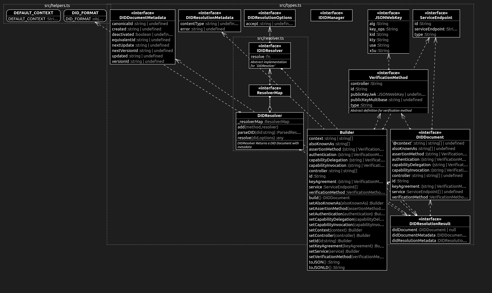

[](https://trackback.co.nz/)

[](https://github.com/trackback-blockchain/trackback-verifiable/tree/main/packages/trackback-did)
[](https://github.com/trackback-blockchain/trackback-verifiable/tree/main/packages)
[](https://nodejs.org/es/blog/release/v14.0.0)
[](https://lerna.js.org/)

# TrackBack DID SDK

The library is intended to be used as a common template for resolving a DID.

Supports [Decentralized Identifiers](https://w3c.github.io/did-core/#identifier) spec.

## IMPORTANT!

* This is a minimum viable product suite with limited functionality.
* Please do not use this for production

## TrackBack DID

## Installation

```bash
yarn install
```

## Usage

### importing DID builder and resolver

ES Modules import

```javascript

import { Builder, DIDResolver } from '@trackback/did'

```

CommonJS import

```javascript

const { Builder, DIDResolver } = require('@trackback/did');

```

## Example

Following shows how to resolve a DID using different libraries

```javascript
const { DIDResolver } = require('@trackback/did');
const { Connector } = require('@trackback/agent');

const customWebResolver = {resolve:(didUri)=>{...}}

const connector = new Connector();
const agent = new TrackBackAgent(connector);

const resolver = new DIDResolver();

resolver.add('web', customWebResolver);
resolver.add('trackback', agent.procedure);

const result: DIDResolutionResult = await resolver.resolve(
'did:web:test1234'
);

// {
//   didResolutionMetadata: {...},
//   didDocument: {...},
//   didDocumentMetadata: {...},
// };

```
